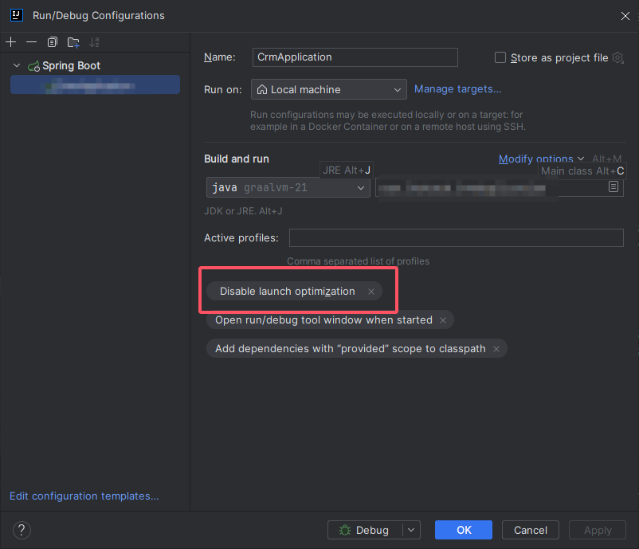
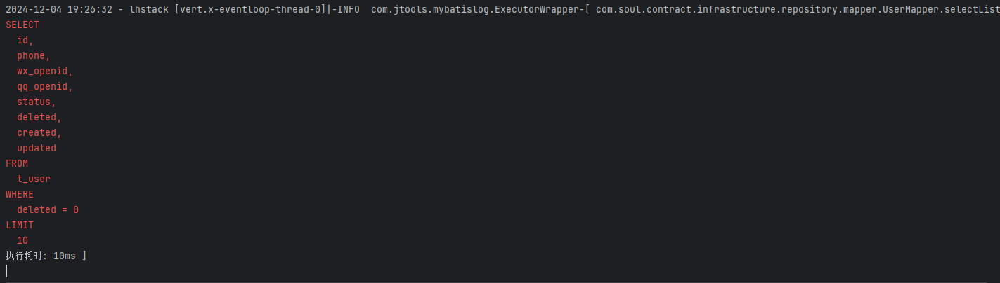

## English
1. This plugin can print the complete log and sql execution time of any project that uses mybatis,mybatis-plus.
2. You just need to install it, and it will do the work of extracting sql and concatenating parameters for you.
3. I think this plugin can help you solve a lot of problems, you will like this plugin.

## 中文
1. 这个插件可以打印完整的日志和sql执行时间的任何项目，使用mybatis，mybatis-plus。
2. 您只需要安装它，它就会为您完成提取sql和拼接参数的工作。
3. 我觉得这个插件可以帮你解决很多问题，你会喜欢这个插件的。

## 如果遇到项目在debug下无法启动的问题，请设置Disable launch optimization
`If you encounter the problem that the project cannot start under debug, set Disable launch optimization`

